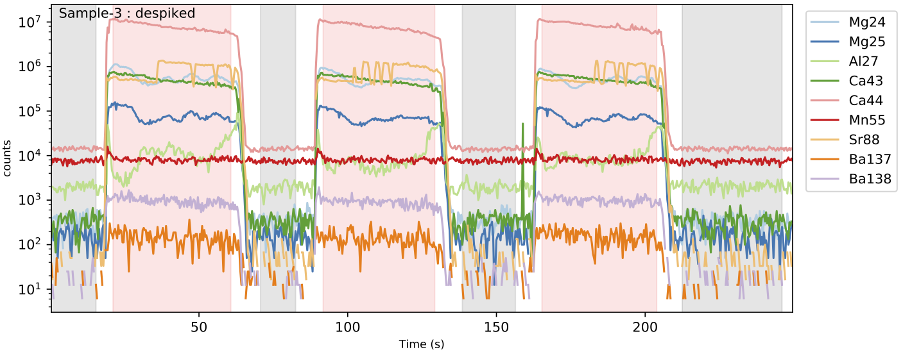

.. _bkgcorrect:

#####################
Background Correction
#####################

The de-spiked data must now be background-corrected. This involves three steps:

1. Signal and background identification.
2. Background calculation underlying the signal regions.
3. Background subtraction from the signal.

Signal / Background Separation
==============================
This is achieved automatically using :meth:`~latools.analyse.autorange` using the internal standard (Ca43, in this case), to discriminate between 'laser off' and 'laser on' regions of the data. Fundamentally, 'laser on' regions will contain high counts, while 'laser off' will contain low counts of the internal standard. The mid point between this high and low offers a good starting point to approximately identify 'signal' and 'background' regions. Regions in the ablation with higher counts than the mid point are labelled 'signal', and lower are labelled 'background'. However, because the transition between laser-on and laser-off is not instantaneous, both signal and background identified by this mid-point will contain part of the 'transition', which must be excluded from both signal and background. This is accomplished by a simple algorithm, which determines the width of the transition and excludes it:

1. Extract each approximate transition, and calculate the first derivative. As the transition is approximately sigmoid, the first derivative is approximately Gaussian.
2. Fit a Gaussian function to the first derivative to determine its width. This fit is weighted by the distance from the initial transition guess.
3. Exclude regions either side of the transitions from both signal and background regions, based on the full-width-at-half-maximum (FWHM) of the Gaussian fit. The pre- and post-transition exclusion widths can be specified independently for 'off-on' and 'on-off' transitions.

Several parameters within :meth:`~latools.analyse.autorange` can be modified to subtly alter the behaviour of this function.
However, in testing the automatic separation proved remarkably robust, and you should not have to change these parameters much.

The function is applied to your data by running:

.. literalinclude:: ../../../../tests/test_beginnersGuide.py
   :language: python
   :dedent: 4
   :lines: 24-25

In this case, ``on_mult=[1.5, 0.8]`` signifies that a 1.5 x FWHM of the transition will be removed *before* the off-on transition (on the 'background' side), and 0.8 x FWHM will be removed *after* the transition (on the 'signal' side), and vice versa for the on-off transition. This excludes more from the background than the signal, avoiding spuriously high background values caused by the tails of the signal region.

.. tip:: **Look at your data!** You can see the regions identified as 'signal' and 'background' by this algorithm by plotting your data using ``eg.trace_plots(ranges=True)``. Because the analysis has progressed since the last time you plotted (the data have been de-spiked), these plots will be saved in a new ``de-spiked`` sub-folder within the ``reports_data`` folder. This will produce plots with 'signal' regions highlighted in red, and 'background' highlighted in grey:

Background Calculation
======================
Once the background regions of the ablation data have been identified, the background underlying the signal regions must be calculated.
At present, ``latools`` includes two background calculation algorithms:

* :meth:`~latools.analyse.bkg_calc_interp1d` fits a polynomial function to all background regions, and calculates the intervening background values using a 1D interpolation (numpy's interp1D function). The order of the polynomial can be specified by the 'kind' variable, where kind=0 simply interpolates the mean background forward until the next measured background region.
* :meth:`~latools.analyse.bkg_calc_weightedmean` calculates a Gaussian-weighted moving average, such that the interpolated background at any given point is determined by adjacent background counts on either side of it, with the closer (in Time) being proportionally more important. The full-width-at-half-maximum (FWHM) of the Gaussian weights must be specified, and should be greater than the time interval between background measurements, and less than the time-scale of background drift expected on your instrument.

.. warning:: Use extreme caution with polynomial backgrounds of order>1. You should only use this if you know you have significant non-linear drift in your background, which you understand but cannot be dealt with by changing you analytical procedure. In all tested cases the weighted mean background outperformed the polynomial background calculation method.

.. note:: Other background fitting functions can be easily incorporated. If you're Python-literate, we welcome your contributions. If not, get in touch!

For this demonstration, we will use the :meth:`~latools.analyse.bkg_calc_weightedmean` background, with a FWHM of 5 minutes (``weight_fwhm=300`` seconds), that only considers background regions that contain greater than 10 points (``n_min=10``):

.. literalinclude:: ../../../../tests/test_beginnersGuide.py
   :language: python
   :dedent: 4
   :lines: 27-28

and plot the resulting background:

.. literalinclude:: ../../../../tests/test_beginnersGuide.py
   :language: python
   :dedent: 4
   :lines: 30

which is saved in the ``reports_data`` subdirectory, and should look like this:

.. image:: ./figs/background.png

Background Subtraction
======================

Once the background is calculated, it subtracted from the signal regions using :meth:`~latools.analyse.bkg_correct`:

.. literalinclude:: ../../../../tests/test_beginnersGuide.py
   :language: python
   :dedent: 4
   :lines: 32

.. tip:: Remember that you can plot the data and examine it at any stage of your processing. running ``eg.trace_plots()`` now would create a new subdirectory called 'bkgcorrect' in your 'reports_data' directory, and plot all the background corrected data.