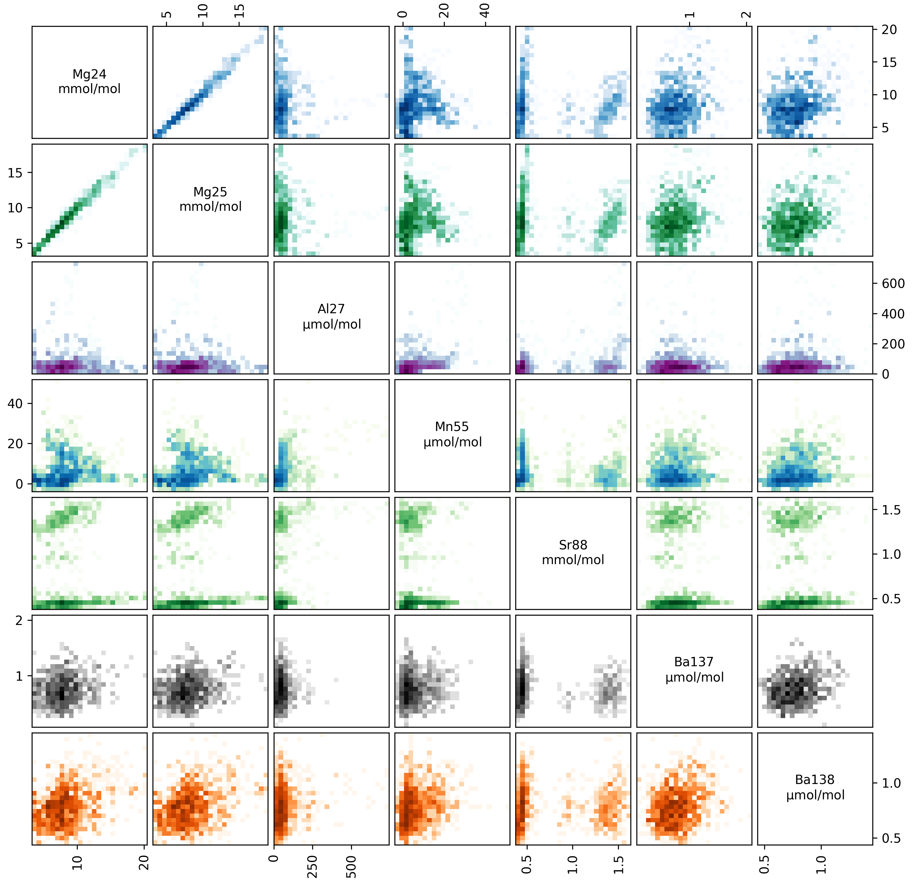

.. _filtering:

############################
Data Selection and Filtering
############################

The data are now background corrected, normalised to an internal standard, and calibrated.
Now we can get into some of the new features of ``latools``, and start thinking about **data filtering**.

What is Data Filtering?
=======================
Laser ablation data are spatially resolved.
In heterogeneous samples, this means that the concentrations of different analytes will change within a single analysis.
This compositional heterogeneity can either be natural and expected (e.g. Mg/Ca variability in foraminifera), or caused by compositionally distinct contaminant phases included in the sample structure.
If the end goal of your analysis is to get integrated compositional estimates for each ablation analysis, how you deal with sample heterogeneity becomes central to data processing, and can have a profound effect on the resulting integrated values.
So far, heterogeneous samples tend to be processed manually, by choosing regions to integrate by eye, based on a set of criteria and knowledge of the sample material.
While this is a valid approach to data reduction, it is not reproducible: if two 'expert analysts' were to process the data, the resulting values would not be quantitatively identical.
Reproducibility is fundamental to sound science, and the inability to reproduce integrated values from identical raw data is a fundamental flaw in Laser Ablation studies.
In short, this is a serious problem.

To get round this, we have developed 'Data Filters'.
Data Filters are systematic selection criteria, which can be applied to all samples to select specific regions of ablation data for integration.
For example, the analyst might apply a filter that removes all regions where a particular analyte exceeds a threshold concentration, or exclude regions where two contaminant elements co-vary through the ablation.
Ultimately, the choice of selection criteria remains entirely subjective, but because these criteria are quantitative they can be uniformly applied to all specimens, and most importantly, reported and reproduced by an independent researcher.
This removes significant possibilities for 'human error' from data analysis, and solves the long-standing problem of reproducibility in LA-MS data processing.

Data Filters
============
``latools`` includes several filtering functions, which can be created, combined and applied in any order, repetitively and in any sequence.
By their combined application, it should be possible to isolate any specific region within the data that is systematically identified by patterns in the ablation profile.
These filter are (in order of increasing complexity):

* :meth:`~latools.analyse.filter_threshold`: Creates two filter keys identifying where a specific analyte is above or below a given threshold.
* :meth:`~latools.analyse.filter_distribution`: Finds separate `populations` within the measured concentration of a single analyte within by creating a Probability Distribution Function (PDF) of the analyte within each sample. Local minima in the PDF identify the boundaries between distinct concentrations of that analyte within your sample.
* :meth:`~latools.analyse.filter_clustering`: A more sophisticated version of :meth:`~latools.analyse.filter_distribution`, which uses data clustering algorithms from the `sklearn <http://scikit-learn.org/>`_ module to identify compositionally distinct 'populations' in your data. This can consider multiple analytes at once, allowing for the robust detection of distinct compositional zones in your data using n-dimensional clustering algorithms.
* :meth:`~latools.analyse.filter_correlation`: Finds regions in your data where two analytes correlate locally. For example, if your analyte of interest strongly co-varies with an analyte that is a known contaminant indicator, the signal is likely contaminated, and should be discarded.

It is also possible to 'train' a clustering algorithm based on analyte concentrations from *all* samples, and then apply it to individual filters.
To do this, use:

* :meth:`~latools.analyse.fit_classifier`: Uses a clustering algorithm based on specified analytes in *all* samples (or a subset) to identify separate compositions within the entire dataset. This is particularly useful if (for example) all samples are affected by a contaminant with a unique composition, or the samples contain a chemical 'label' that identifies a particular material. This will be most robustly identified at the whole-analysis level, rather than the individual-sample level.
* :meth:`~latools.analyse.apply_classifier`: Applies the classifier fitted to the entire dataset to all samples individually. Creates a sample-level filter using the classifier based on all data.

For a full account of these filters, how they work and how they can be used, see :ref:`advanced_filtering`.

Simple Demonstration
====================

Choosing a filter
-----------------
The foraminifera analysed in this example dataset are from culture experiments and have been thoroughly cleaned.
There should not be any contaminants in these samples, and filtering is relatively straightforward.
The first step in choosing a filter is to *look* at the data.
You can look at the calibrated profiles manually to get a sense of the patterns in the data (using ``eg.trace_plots()``):

.. image:: ./figs/calibrated_Sample-3.png

Or alternatively, you can make a 'crossplot' (using ``eg.crossplot()``) of your data, to examine how all the trace elements in your samples relate to each other:

This plots every analyte in your ablation profiles, plotted against every other analyte. The axes in each panel are described by the diagonal analyte names. The colour intensity in each panel corresponds to the data density (i.e. it's a 2D histogram!).

Within these plots, you should focus on the behaviour of 'contaminant indicator' elements, i.e. elements that are normally within a known concentration range, or are known to be associated with a possible contaminant phase.
As these are foraminifera, we will pay particularly close attention to the concentrations of Al, Mn and Ba in the ablations, which are all normally low and homogeneous in foraminifera samples, but are prone to contamination by clay particles.
In these samples, the Ba and Mn are relatively uniform, but the Al increases towards the end of each ablation.
This is because the tape that the specimens were mounted on contains a significant amount of Al, which is picked up by the laser as it ablates through the shell.
We know from experience that the tape tends to have very low concentration of other elements, but to be safe we should exclude regions with hi Al/Ca from our analysis.

Creating a Filter
-----------------
We wouldn't expect cultured foraminifera to have a Al/Ca of ~100 µmol/mol, so we therefore want to remove all data from regions with an Al/Ca above this.
We'll do this with a threshold filter:

.. literalinclude:: ../../../../tests/test_beginnersGuide.py
   :language: python
   :dedent: 4
   :lines: 41

This goes through *all* the samples in our analysis, and works out which analyses have an Al/Ca both greater than and less than 100 µmol/mol (remember, all units are in mol/mol at this stage).
This function calculates the filters, but does not apply them - that happens later.
Once the filters are calculated, a list of filters and their current status is printed::

    Subset All_Samples:
    Samples: Sample-1, Sample-2, Sample-3

    n  Filter Name          Mg24   Mg25   Al27   Ca43   Ca44   Mn55   Sr88   Ba137  Ba138  
    0  Al27_thresh_below    False  False  False  False  False  False  False  False  False  
    1  Al27_thresh_above    False  False  False  False  False  False  False  False  False

You can also check this manually at any time using::

    eg.filter_status()

This produces a grid showing the filter numbers, names, and which analytes they are active for (for each analyte False = inactive, True = active). 
The ``filter_threshold`` function has generated two filters: one identifying data above the threshold, and the other below it.
Finally, notice also that it says 'Subset: All_Samples' at the top, and lists which samples they are. 
You can apply different filters to different subsets of samples... We'll come back to this later.
This display shows all the filters you've calculated, and which analytes they are applied to. 

Before we think about applying the filter, we should check what it has actually done to the data.

.. note:: Filters do not delete any data. They simply create a *mask* which tells latools functions which data to use, and which to ignore.

Checking a Filter
-----------------
You can do this in three ways:

1. Plot the traces, with ``filt=True``. This plots the calibrated traces, with areas excluded by the filter shaded out in grey. Specifying ``filt=True`` shows the net effect of all active filters. By setting ``filt`` as a number or filter name, the effect of one individual filter will be shown.
2. Crossplot with ``filt=True`` will generate a new crossplot containing only data that remains after filtering. This can be useful for refining filter choices during multiple rounds of filtering. You can also set ``filt`` to be a filter name or a number, as with trace plotting.
3. The most sophisticated way of looking at a filter is by creating a 'filter_report'. This generates a plot of each analysis, showing which regions are selected by particular filters:

.. literalinclude:: ../../../../tests/test_beginnersGuide.py
   :language: python
   :dedent: 4
   :lines: 43

Where ``analytes`` specifies which analytes you want to see the influence of the filters on, and ``filt_str`` identifies which filters you want to see.
``filt_str`` supports partial filter name matching, so 'thresh' will pick up any filter with 'thresh' in the name - i.e. if you'd calculated multiple thresholds, it would plot each on a different plot.
If all has gone to plan, it will look something like this:

.. image:: ./figs/thresh_Sample-3_Al27.png

In the case of a threshold filter report, the dashed line shows the threshold, and the legend identifies which data regions are selected by the different filters (in this case '0_below' or '1_above').
The reports for different types of filter are slightly different, and often include numerous groups of data.
In this case, the 100 µmol/mol threshold seems to do a good job of excluding extraneously high Al/Ca values, so we'll use the '0_Al27_thresh_below' filter to select these data.

Applying a Filter
-----------------
Once you've identified which filter you want to apply, you must turn that filter 'on' using:

.. literalinclude:: ../../../../tests/test_beginnersGuide.py
   :language: python
   :dedent: 4
   :lines: 45

Where ``filt`` can either be the filter number (corresponding to the 'n' column in the output of ``filter_status()``) or a partially matching string, as here.
For example, ``'Albelow'`` is most similar to ``'Al27_thresh_below'``, so this filter will be turned on. You could also specify ``'below'``, which would turn on all filters with 'below' in the name. This is done using 'fuzzy string matching', provided by the ``fuzzywuzzy`` package.
There is also a counterpart ``eg.filter_off()`` function, which works in the inverse.
These functions will turn the threshold filter on for all analytes measured in all samples, and return a report of which filters are now on or off::

    Subset All_Samples:
    Samples: Sample-1, Sample-2, Sample-3

    n  Filter Name          Mg24   Mg25   Al27   Ca43   Ca44   Mn55   Sr88   Ba137  Ba138  
    0  Al27_thresh_below    True   True   True   True   True   True   True   True   True   
    1  Al27_thresh_above    False  False  False  False  False  False  False  False  False  

In some cases, you might have a sample where one analyte is effected by a contaminant that does not alter other analytes.
If this is the case, you can switch a filter on or off for a specific analyte:

.. literalinclude:: ../../../../tests/test_beginnersGuide.py
   :language: python
   :dedent: 4
   :lines: 47

.. code-block:: python

    Subset All_Samples:
    Samples: Sample-1, Sample-2, Sample-3

    n  Filter Name          Mg24   Mg25   Al27   Ca43   Ca44   Mn55   Sr88   Ba137  Ba138  
    0  Al27_thresh_below    True   False  True   True   True   True   True   True   True   
    1  Al27_thresh_above    False  False  False  False  False  False  False  False  False  

Notice how the 'Al27_thresh_below' filter is now deactivated for Mg25.

Sample Subsets
--------------
Finally, let's return to the 'Subsets', which we skipped over earlier.
It is quite common to analyse distinct sets of samples in the same analytical session.
To accommodate this, you can create data 'subsets' during analysis, and treat them in different ways.
For example, imagine that 'Sample-1' in our test dataset was a different type of sample, that needs to be filtered in a different way.
We can identify this as a subset by:

.. literalinclude:: ../../../../tests/test_beginnersGuide.py
   :language: python
   :dedent: 4
   :lines: 49-50

And filters can be turned on and off independently for each subset::

    eg.filter_on(filt=0, subset='set1')

    Subset set1:
    Samples: Sample-1

    n  Filter Name          Mg24   Mg25   Al27   Ca43   Ca44   Mn55   Sr88   Ba137  Ba138  
    0  Al27_thresh_below    True   True   True   True   True   True   True   True   True   
    1  Al27_thresh_above    False  False  False  False  False  False  False  False  False  

    eg.filter_off(filt=0, subset='set2')

    Subset set2:
    Samples: Sample-2, Sample-3

    n  Filter Name          Mg24   Mg25   Al27   Ca43   Ca44   Mn55   Sr88   Ba137  Ba138  
    0  Al27_thresh_below    False  False  False  False  False  False  False  False  False  
    1  Al27_thresh_above    False  False  False  False  False  False  False  False  False

To see which subsets have been defined::

    eg.subsets

    {'All_Analyses': ['Sample-1', 'Sample-2', 'Sample-3', 'STD-1', 'STD-2'],
     'All_Samples': ['Sample-1', 'Sample-2', 'Sample-3'],
     'STD': ['STD-1', 'STD-2'],
     'set1': ['Sample-1'],
     'set2': ['Sample-2', 'Sample-3']}

.. note:: The filtering above is relatively simplistic. More complex filters require quite a lot more thought and care in their application. For examples of how to use clustering, distribution and correlation filters, see the :ref:`Advanced Filtering <advanced_filtering>` section.

